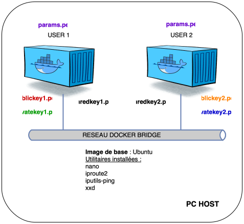
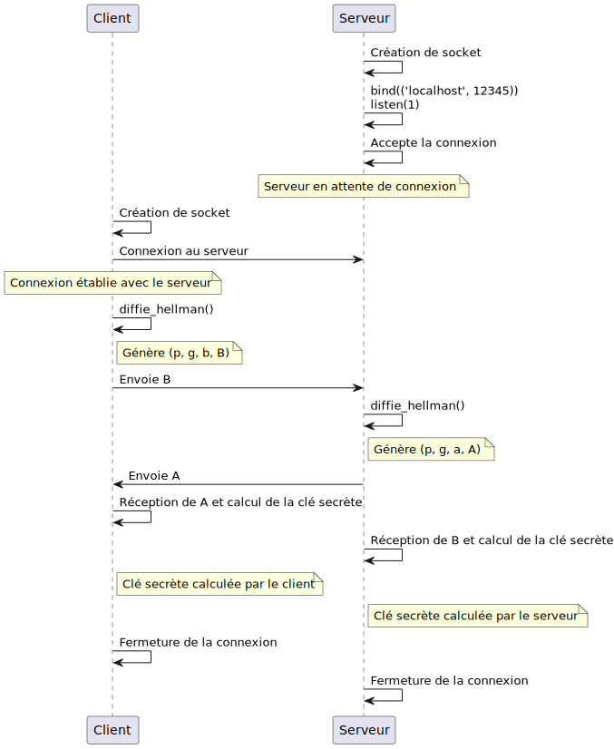

# GÉNÉRATION D'UNE CLÉ PARTAGÉE AVEC LE PROTOCOLE DIFFIE-HELLMAN

### Génération des paramètres DIFFIE-HELLMAN :
```bash
openssl dhparam -out dhparams.pem 2048
```
### GÉNÉRATION DES CLÉS PRIVÉES ET PUBLIQUES SUR LE USER1
```bash
openssl genpkey -paramfile dhparams.pem -out privatekey1.pem
openssl pkey -in privatekey1.pem -pubout -out publickey1.pem
```
### GÉNÉRATION DES CLÉS PRIVÉES ET PUBLIQUES SUR LE USER2
```bash
openssl genpkey -paramfile dhparams.pem -out privatekey2.pem
openssl pkey -in privatekey2.pem -pubout -out publickey2.pem
```
### GÉNÉRATION DE LA CLÉ PARTAGÉE SUR LE USER1
```bash
openssl pkeyutl -derive -inkey privatekey1.pem -peerkey publickey2.pem -out sharedkey1.bin
```
### GÉNÉRATION DE LA CLÉ PARTAGÉE SUR LE USER2
```bash
openssl pkeyutl -derive -inkey privatekey2.pem -peerkey publickey1.pem -out sharedkey2.bin
```
### VÉRIFICATION
```bash
diff sharedkey1.bin sharedkey2.bin && echo "Les clés partagées sont identiques" || echo "Les clés partagées sont différentes"
```
## ÉCHANGE D'UN SECRET AVEC DIFFIE-HELLMAN ENTRE DEUX HOSTS Á TRAVERS UN SOCKET TCP :

